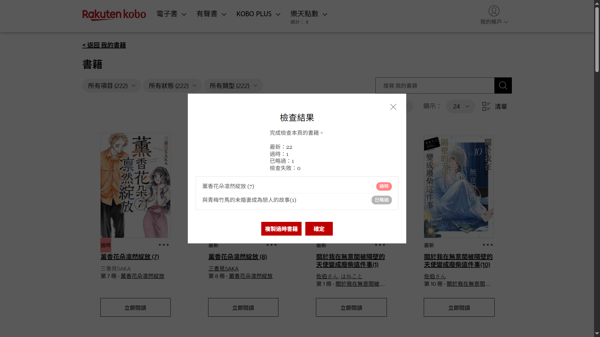
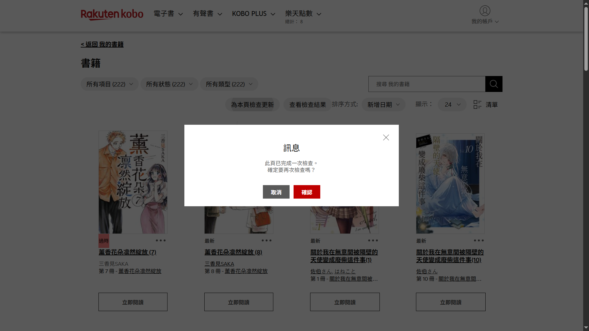

# Kobo 電子書更新檢查器

[English](README.md)

檢查你在 [Kobo](https://www.kobo.com/) 購買的電子書是否有更新檔提供。

## 來源

本專案 fork 自 [Kobo e-Books Update Checker](https://greasyfork.org/scripts/482410)，原作者為 **Jason Kwok**。

## 本 Fork 的改動

- **檢查結果檢視** — 完成檢查後自動彈出結果視窗，顯示統計摘要與可捲動的書籍清單，每本書以彩色標籤標示狀態。
- **複製過時書籍** — 結果視窗內提供「複製過時書籍」按鈕，一鍵將所有過時書名複製到剪貼簿。
- **複製空白範本並聯絡客服** — 結果視窗內提供「複製空白範本並聯絡客服」按鈕，一鍵複製預寫好的客服請求範本至剪貼簿，並在新分頁開啟 Kobo 客服中心，方便請求書檔更新。
- **重複檢查確認** — 同一頁已檢查過的情況下，再次點擊檢查按鈕會先詢問確認，避免誤觸重複檢查。

## 安裝方式

1. 安裝瀏覽器擴充套件：[Tampermonkey](https://www.tampermonkey.net/) 或 [Violentmonkey](https://violentmonkey.github.io/)
2. 點擊安裝本 UserScript（或手動將 `kobo-ebooks-update-checker.user.js` 的內容貼入腳本管理器）
3. 前往 [Kobo 書架頁面](https://www.kobo.com/)，即可使用

## 演示

  

  

## 授權

[MIT](LICENSE) — 原作者 Jason Kwok，fork 維護者 kevin823lin
